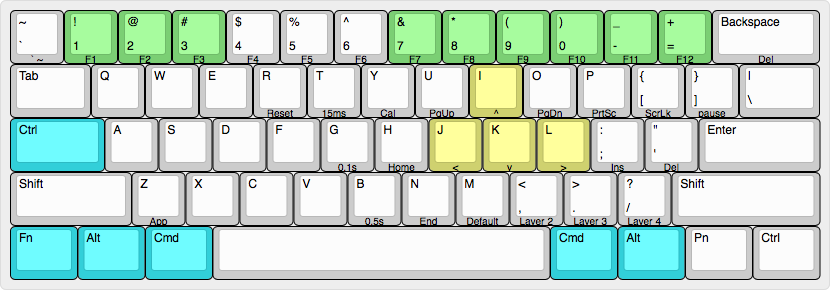

# vortex-pok3r-layout

My personal MacOS layout for the Vortex POK3R mechanical keyboard (ISO).

## Current layout

I only use the layer 2 for now, and this is its current disposition.

- Special keys depicted in cyan.
- Arrow keys depicted in yellow.
- Function keys depicted in green.

Instructions on how to set these mappings can be found [here](./instructions.md).

_Image made with [Keyboard Layout Editor](http://www.keyboard-layout-editor.com)._

## Mappings

### Arrow-keys

| Function | Default | Mapping |
|---|---|---|
| Up-Arrow | `Fn-I` | -- |
| Down-Arrow | `Fn-K` | -- |
| Left-Arrow | `Fn-J` | -- |
| Right-Arrow | `Fn-L` | -- |
| Page-Up | `Fn-U` | -- |
| Page-Down | `Fn-O` | -- |

### Function-keys

| Function | Default | Mapping |
|---|---|---|
| Less-Brightness | `Fn-{` | `Fn-1` |
| More-Brightness | `Fn-}` | `Fn-2` |
| Show-Desktop | `Fn--` | `Fn-3` |
| Previous-Song | `Fn-Q` | `Fn-7` |
| Play/Pause | `Fn-W` | `Fn-8` |
| Next-Song | `Fn-E` | `Fn-9` |
| Mute/Unmute | `Fn-F` | `Fn-10` |
| Volume-Down | `Fn-S` | `Fn-11` |
| Volume-Up | `Fn-D` | `Fn-12` |

### Special keys

| Defaults | Mapping |
|---|---|
| `Right_Fn` | `Left-Ctrl` \* |
| `Left_Cmd` | `Right_Alt` |
| `Right_Alt` | `Right_Fn` |
| `Left_Cmd` | `Left_Alt` |
| `Left_Alt` | `Left_Cmd` |
| `Right_Ctrl` | `Right_Pn` |

\*: Changing the position of the `Fn` key requires [special instructions](./instructions.md#special-keys).

### Additional personal shortcuts / information

- Switch to Desktop-num (_set in OS on Ctrl-num_)
- Change Input Source (_set in OS on Cmd-Shift-Z_)
- Open Terminal (_set in OS on Cmd-Shift-T_)
- Left-Shift + ESC = ~ (_set by default_)
- Mission-control to Ctrl-up (_set by default_)
- Application-windows to Ctrl-down (_set by default_)

## Sources

- [r/MechanicalKeyboards](www.reddit.com/r/MechanicalKeyboards)
    - [Guide on how to program pok3r programming layers](https://www.reddit.com/r/MechanicalKeyboards/comments/35uy60/guide_howto_program_your_pok3r_programming_layers/)
    - [Modification of pok3r media volume controls](https://www.reddit.com/r/MechanicalKeyboards/comments/37j3sx/guide_modification_pok3r_media_volume_controls_hw/)
- [Vortex Guide](http://www.vortexgear.tw/db/upload/webdata4/6vortex_20166523361966663.pdf)
